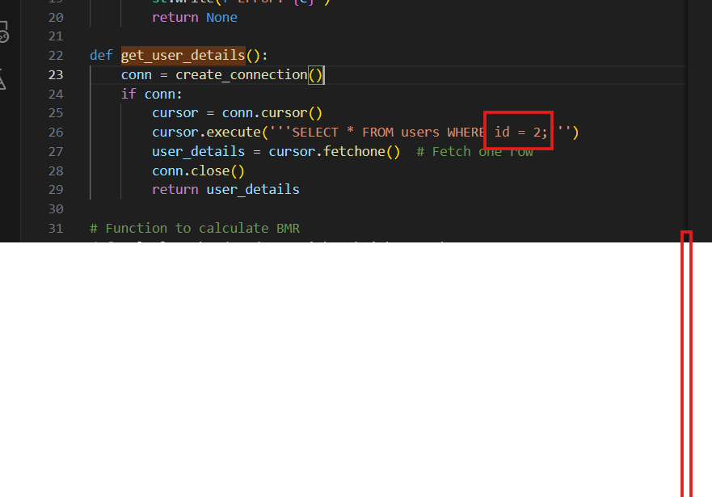
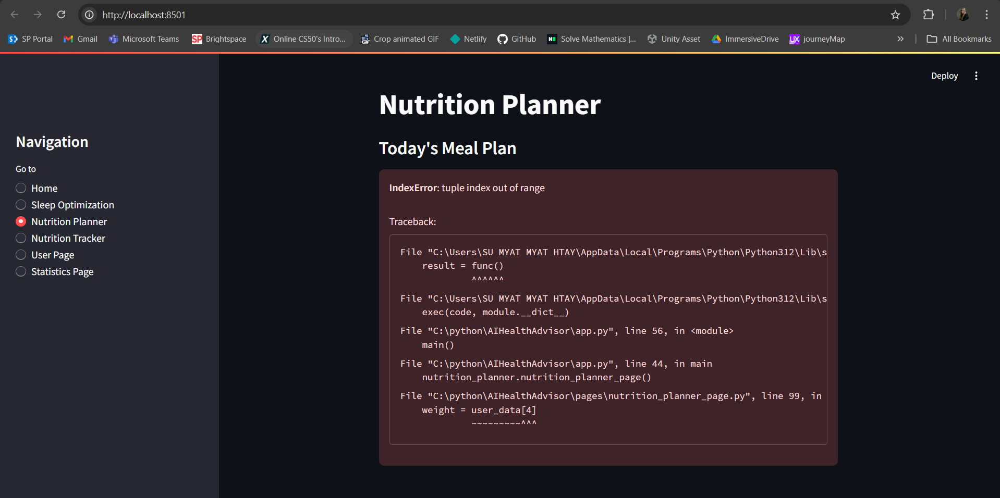
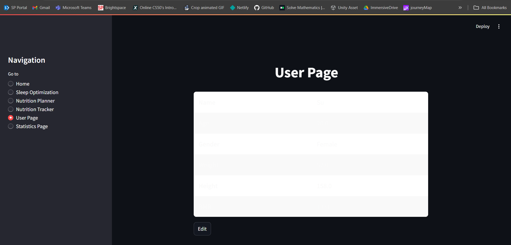
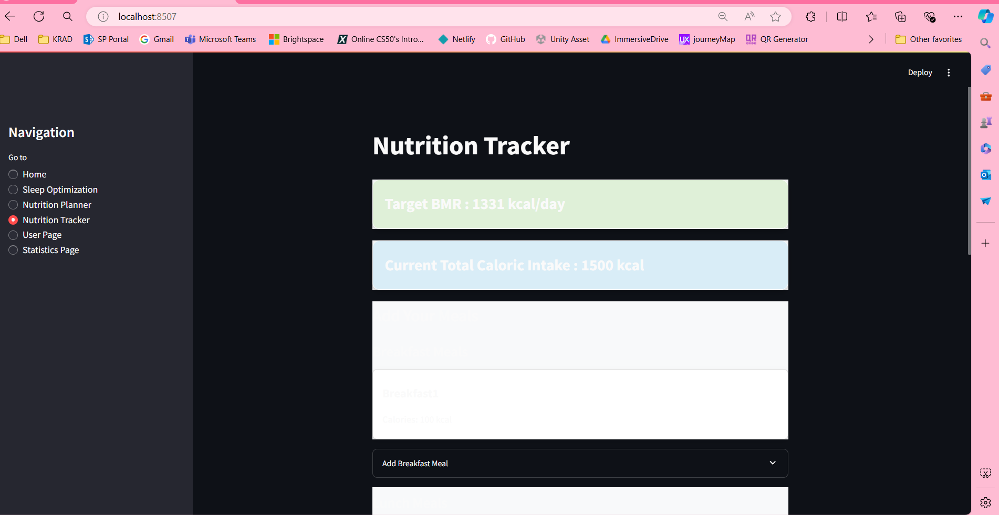
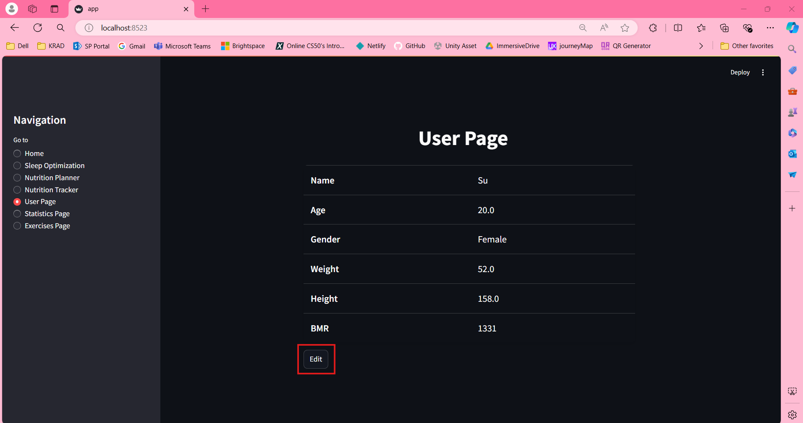

# How to run the streamlit for now

streamlit run app.py

# How to run both streamlit and camera

python runscript.py

# How to set up

- run "python mysql_createdb.py"
- run "pip install plotly"
- deploy the currentFlow.json under the Node-Red folder.
- click onthe timestamp and the streamlit app should be running.

# What will be in next release

- Some pages showing error before login.
- Print out the Login first text on pages before login.
- User Info request page connect.
- Home page connect with Eunice Steps, Sleep Record and sort of.
- One main file to handle the database connection rather than putting details in everything.
- I will make the python file to install all the data and all the necessary thingys in one shot. (FIXED)
- I will combine setup part in one shot (FIXED)

# The Database Info that we will be using

host="localhost",
user="root",
password="",
database="iot"

# Progress Updates

- Node-Red flow of sleep optimization is perfectly working with starting and termination process. Check out the currentflow.json
- Sleep Optimization is working perfectly fine. Adjust here and there for user page and statistics then should be good to go.

# Filenames

- ciot_app_model => In Use (To train the AI)
- ciot_detect => Not in Use (currently using faceDetect.py)
- faceDetect => In Use (To detect the face in camera)
- mysql_createdb.py => In Use (To create the things in advance before starting anything)
- mysqlcheck => To Test (To test our database connection)
- runscript => To Test (To run two files at the same time)
- app.py => In Use (The streamlit app)
- suTest.py => To Test
- tempData.json => System Create File (To store temp data. For example, the login id)
- pages folder => different pages streamlit files
- datasets folder => pictures to train the model for the face recognition
- Node-RED => exported Node Red flow.

# Bugs Left to Fix

- Login button needs to click twice to login
- Face Upload Page needs to click twice to disable (but do not crash the server)
- Wake Up button needs to click thrice to disable (but do not crash the server)
- After Register, the user does not lead to the Login Page directly

# Fixed Bugs

- Camera does not terminate when the user successfully insert the data into db but it terminates without db. I think need to check the asyn and sync later. (FIXED!)
- It is inserting to the database two times. (FIXED!)
- Wake Up button needs to click thrice to disable (but do not crash the server) (FIXED!)

# Minor Flag Outs

- Nothing yet

# Ei's Errors to Fix

1. Please dont hardcode. Retrieve from tempData.json file instead. (FIXED)
   

2. Ur Nutrition Planner page is not working. Please Fix.
   

3. Please Adjust ur page design. It is very hard to see. If you cannot make it dynamic for both light mode and dark mode, maybe you can try apply color for not just background but also the text itself. (FIXED!)
   

4. Don't forget to adjust color for the Nutrition Tracker also yeah. (FIXED)
   

5. Help me make sure that the user cannot change their username yeah. Else it will have a conflict with sleep optimization. If you want to let the user change the name, create a new column as display_name and change the necessary parts.
   
